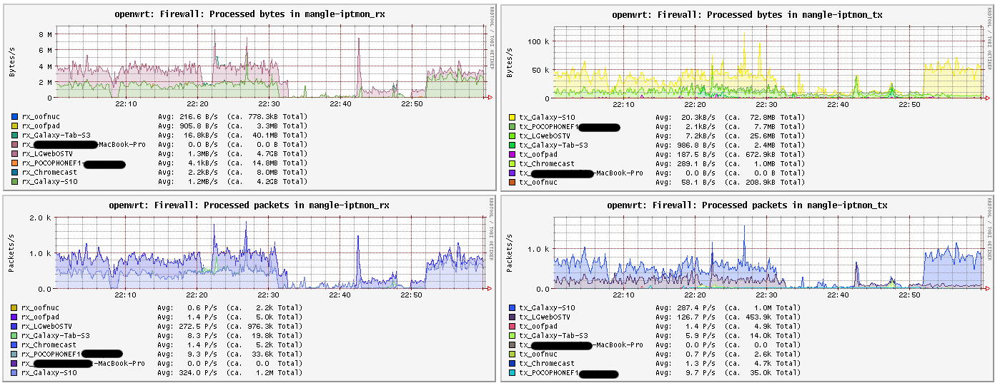

# iptmon: Simple iptables bandwidth monitor

`iptmon` is a script used to create and update `iptables` firewall rules to count transmit and recieve traffic to/from each host. It is intended to be triggered by dnsmasq using the `--dhcp-script` option, so that as new hosts are added and old leases expire, rules are updated dynamically.

Packet and byte counts can then be scraped by `collectd` using the `iptables` plugin. See `files/etc/collectd/conf.d/iptables.conf` for configuration.

Furthermore, `collectd` can push data to InfluxDB, which can in turn be used as a data source for [Grafana dashboards](https://github.com/oofnikj/docker-openwrt/tree/master/monitoring).

Inspired by [wrtbwmon](https://github.com/pyrovski/wrtbwmon).

---

To make use of `iptmon`, you should already be using `luci-app-statistics` and `collectd` to collect and process metrics.

A [patch](files/usr/lib/lua/luci/statistics/rrdtool/definitions/ip6tables.lua) is included for `luci_statistics` to enable IPv6 firewall time series. ([PR](https://github.com/openwrt/luci/pull/3763))

The `iptables` module is used to collect per-host metrics.

**Note** that if you have software offloading enabled `iptmon` **will not** be able to track bandwidth usage properly.

## Installation on OpenWRT

Head over to the [releases](https://github.com/oofnikj/iptmon/releases) page to downloaded the latest `.ipk`.

`iptmon` is a shell script, so it should work on all architectures.

After downloading, install with `opkg install ./iptmon_$VERSION_all.ipk`.

## Removal
To uninstall, run `opkg remove iptmon`.